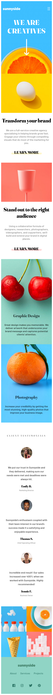
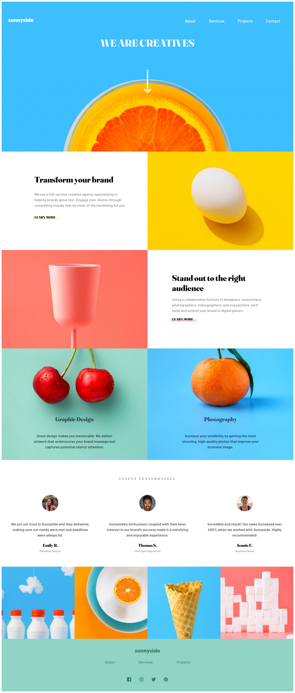

# Frontend Mentor - Sunnyside agency landing page solution

This is a solution to the [Sunnyside agency landing page challenge on Frontend Mentor](https://www.frontendmentor.io/challenges/sunnyside-agency-landing-page-7yVs3B6ef). Frontend Mentor challenges help you improve your coding skills by building realistic projects.

## Table of contents

  - [Overview](#overview)
  - [The challenge](#the-challenge)
  - [Screenshot](#screenshot)
  - [Links](#links)
  - [My process](#my-process)
  - [Built with](#built-with)
  - [Continued development](#continued-development)
  - [Author](#author)

## Overview

### The challenge

Users should be able to:

- View the optimal layout for the site depending on their device's screen size. For this challenge the 2 option layouts are to 375px width screen size for mobile devices and 1440px width for desktop devices.
- See hover states for all interactive elements on the page

### Screenshot
### Mobile - 375px

### Desktop - 1440px

### Links

- Live Site URL: (https://elegant-daifuku-88a825.netlify.app/)

## My process

### Built with

- HTML5 markup
- CSS custom properties
- Flexbox
- CSS Grid
- Mobile-first workflow

### Continued development

I plan to work in future projects in order to develop my knowledge on breakpoints and responsiveness to become a better delevoper.

## Author

- LinkedIn - [Fernando Alves](https://www.linkedin.com/in/fernando-de-paula-alves-889110a5/)
- Twitter - [@fernandu00](https://www.twitter.com/fernandu00)

